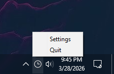

# Timezones

Simple timezones widget for Windows, built with Python.

TimeZones.exe is located in [releases](https://github.com/Saif-Quazi/TimeZones/releases)

## How to use the widget

1. Open widget settings from system tray icon:



2. Configure your city list:
- Add cities by typing a city name and selecting a timezone suggestion.
- Remove cities by clicking the `trash` icon beside a city.
- Drag cities to reorder them based on your preference.
- Click Save before closing the window.


## Local Setup

Install dependencies:
```
pip install -r requirements.txt
```
Run locally:
```
python main.py
```